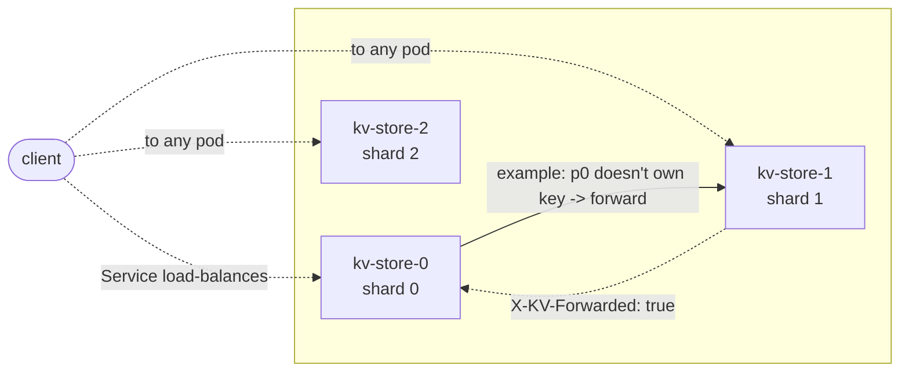
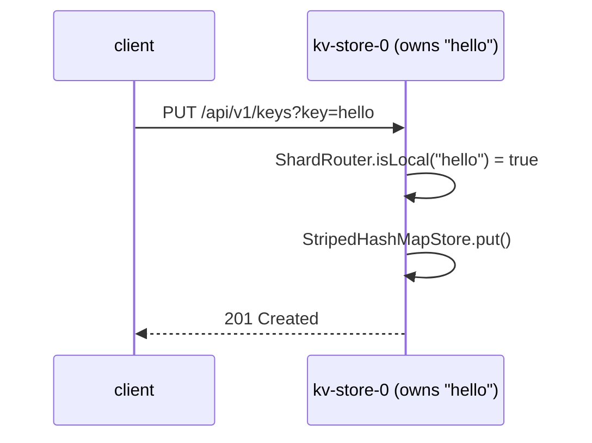
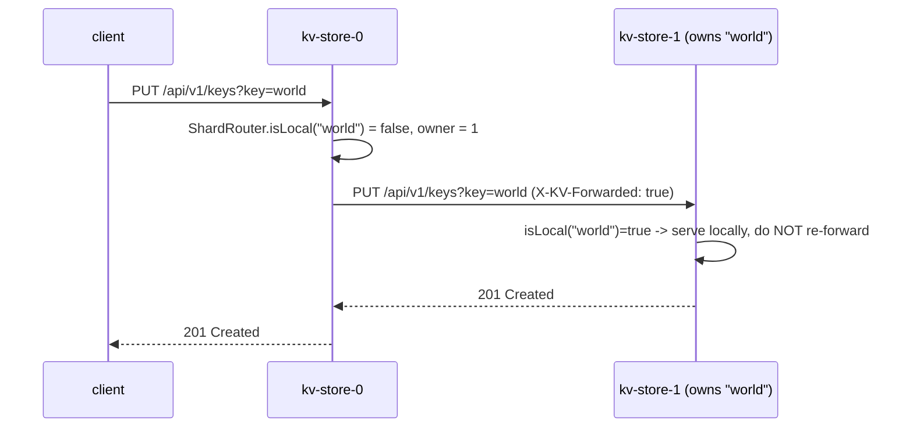

# Distributed In-Memory Key-Value Store

A sharded, in-memory key-value store with a hand-rolled concurrent map, exposed over REST,
fronted by an Angular UI, containerized, and horizontally scalable on Kubernetes with a fixed
replica count set at startup.

This README explains *why* each decision was made, not just what the code does, and includes the
alternatives that were rejected and why.

## Contents

- [Architecture overview](#architecture-overview)
- [Request flow](#request-flow)
- [API](#api)
- [The striped map](#the-striped-map)
- [Decision records](#decision-records)
- [Benchmarks](#benchmarks)
- [How this differs from `ConcurrentHashMap`](#how-this-differs-from-concurrenthashmap)
- [Coming from Node: a design note](#coming-from-node-a-design-note)
- [Non-goals](#non-goals)
- [Running it](#running-it)
- [Testing](#testing)

## Architecture overview

Each pod owns a slice of the keyspace: `owner = FNV-1a(key) mod SHARD_COUNT`. The client-facing
`Service` (`k8s/service.yaml`) is a plain `ClusterIP` that load-balances every incoming request
across **all** pods - so a client's request can land on any of the 3, not a fixed entry point.
Whichever pod receives it: if it owns the key, it answers locally; if not, it forwards the
request over HTTP to the pod that does, and relays the response back. There is no replication -
each key lives on exactly one shard.



Peers address each other through a headless Kubernetes Service using StatefulSet ordinals:
`kv-store-{i}.kv-store-headless.{namespace}.svc.cluster.local:8080`. A pod derives its own shard
index by parsing the ordinal suffix off its own hostname (`kv-store-2` -> shard `2`).

```
com.example.kvstore
  store/       KeyValueStore (interface), StripedHashMapStore, StoreResult (sealed), StoreLimits
  cluster/     ShardRouter, PeerClient, ForwardingStore, ClusterConfig, PeerUnavailableException
  api/         KeyValueController, ClusterController, NodeStatsService, response DTOs, exception handler
  config/      Spring wiring (StoreConfig, ClusterBeansConfig) - the only place either package meets Spring
```

`store/` has zero framework imports - only `java.util.concurrent.locks` and core Java, so "no
third-party libraries in the store" is verifiable just by reading the import list.
`ForwardingStore` implements the same `KeyValueStore` interface the local store does and
decorates it, deciding per key whether to serve locally or proxy. The controller depends only on
`KeyValueStore`, never on `ForwardingStore` or `StripedHashMapStore` directly - which is what
makes the sharding layer unit-testable without a network (`ForwardingStoreTest` mocks
`PeerClient` and never opens a socket) and swappable for a local-only, single-node mode (which is
exactly what happens when `SHARD_COUNT=1`: `ForwardingStore` still wraps the local store, but
`ShardRouter.isLocal()` is unconditionally true, so nothing ever gets proxied).

## Request flow

**Owned key** (client -> the shard that owns it):



**Forwarded key** (client -> a pod that doesn't own it -> the owner -> back):



**Loop prevention.** If pod B ever received a forwarded request for a key it *doesn't* own
(a routing bug, a config mismatch, a bad deploy), it returns `421 Misdirected Request` instead of
forwarding again. Only an un-forwarded request is ever allowed to consult `ForwardingStore` and
proxy onward - a request that already carries `X-KV-Forwarded: true` is always answered from the
local store directly, or rejected with 421. This is enforced in `KeyValueController`, not
`ForwardingStore`, because it's the controller that sees the inbound header.

Verified against a real 3-node cluster (not mocked): a forwarded request for shard 0's key,
sent to shard 0, returns 200; the same request sent to shards 1 or 2 returns 421.

## API

| Method | Path                        | Notes                                                |
|--------|-----------------------------|-------------------------------------------------------|
| PUT    | `/api/v1/keys?key=`         | body: raw value, `text/plain`. 201 created, 200 updated, 507 over a configured limit |
| GET    | `/api/v1/keys/lookup?key=`  | 200 with value, 404 absent |
| DELETE | `/api/v1/keys?key=`         | 204 deleted, 404 absent |
| GET    | `/api/v1/keys?limit=`       | scatter-gather across every shard |
| GET    | `/api/v1/stats`             | this node: shard index, entry count, heap usage |
| GET    | `/api/v1/cluster/stats`     | fan-out of `/stats` from every node |
| GET    | `/api/v1/keys/owner?key=`   | which shard owns a key (used by the UI's cluster view) |

**Key encoding.** Keys are arbitrary strings and may contain `/`, spaces, `%`, or unicode. The
challenge allows two approaches: configure the server to accept URL-encoded slashes in a path
variable, or take the key as a query parameter. **This project uses a query parameter** -
`?key=...` on every endpoint - specifically to avoid Tomcat's default rejection of encoded
slashes in path segments, which otherwise needs container-level configuration
(`ALLOW_ENCODED_SLASH`, `relaxedPathChars`) that's harder to defend line-by-line than "it's a
query parameter, Spring decodes it as UTF-8 automatically." One consequence: since GET needed two
different shapes (fetch-by-key vs. list-with-limit) on the same HTTP method, they live at
different paths - `GET /api/v1/keys/lookup?key=` vs. `GET /api/v1/keys?limit=` - rather than both
being `GET /api/v1/keys`. Tested explicitly with `a/b c%20d` and `café-☕-日本語` as keys
(`KeyValueControllerTest`), round-tripping correctly through PUT/GET/DELETE.

**Bounds.** `kvstore.limits.max-key-length` (default 512), `max-value-length` (default 1 MiB),
`max-entries-per-node` (default 1,000,000) are all configurable; exceeding any of them returns
`507 Insufficient Storage`. Without this, an unbounded PUT loop eventually OOM-kills the pod -
there's no eviction in this design (see [Non-goals](#non-goals)), so admission control is the
only backstop.

## The striped map

`StripedHashMapStore` (`store/StripedHashMapStore.java`) is a hand-rolled concurrent hash map,
String keys to String values only, built from scratch per the challenge's "no third-party
libraries in the store" requirement.

- **16 segments by default** (configurable, must be a power of two), each with its own
  `ReentrantReadWriteLock`, its own bucket array, its own `AtomicInteger` entry count, and its
  own independent resize. Two threads touching different segments never contend.
- **Separate chaining**, not open addressing - a plain singly-linked list per bucket.
- **Two decorrelated hashes inside the map itself**: the spread hash's high bits pick the
  segment, the low bits pick the bucket within it, so segment choice and bucket choice don't
  correlate. Shard routing across pods (`ShardRouter`) uses a *third*, different function
  (FNV-1a) again, so shard selection and in-node bucket selection are also uncorrelated.
- **`ReentrantReadWriteLock`, not `synchronized`** - readers proceed concurrently, and
  `synchronized` pins a virtual thread to its carrier platform thread for the duration of the
  block (JEP 444), which defeats the point once the app runs on virtual threads.
- **No `volatile` on the node fields.** Correctness rests on the lock's own happens-before
  guarantee (JLS 17.4.4: unlock happens-before the next thread's lock on the same lock), not on
  field-level volatility.
- **Null rejection.** `get(key) == null` would be ambiguous between "no such key" and "key mapped
  to null" - the same reasoning `ConcurrentHashMap`'s own javadoc gives for rejecting nulls.
  Absence is expressed via `StoreResult.NotFound`, never a null return.
- **`size()` is a documented point-in-time estimate** - the sum of per-segment counters, none
  taken under a lock. A linearizable count would mean holding all 16 write locks for the
  duration of the call, turning an O(1)-ish stat read into a stop-the-world pause.

## Decision records

**Sharding vs. full replication.** Rejected replication (every node holds every key) because it
either needs a consensus protocol (Raft/Paxos) to keep replicas consistent under concurrent
writes - real complexity to defend correctly - or it accepts eventual consistency and
the read-your-writes surprises that come with it. Sharding keeps each key on exactly one node,
so there's a single source of truth per key and no replication protocol to build. The cost is
explicit: losing a pod loses its shard's data outright (see [Non-goals](#non-goals)).

**Custom map vs. `ConcurrentHashMap`.** The challenge asks for a from-scratch store so the
concurrency reasoning is visible, not hidden inside the JDK. See
[How this differs from `ConcurrentHashMap`](#how-this-differs-from-concurrenthashmap) for the
honest cost of that choice, measured, not asserted.

**Striped locks vs. one global lock vs. one lock per bucket.** One global lock (or
`Collections.synchronizedMap`) is the simplest possible correct thing, but serializes every
operation regardless of which keys are touched. One lock per bucket is the finest possible
granularity but means allocating and managing a lock per bucket *and* coordinating locks across a
resize (a bucket's lock doesn't obviously "belong" anywhere once the table doubles and every
bucket's contents get rehashed into a new array). Striping at the segment level is the middle
ground: a fixed, small number of locks (16 by default), each independent, each with its own
table that can resize on its own without touching any other segment's lock - real parallelism
across segments, without per-bucket lock lifecycle to manage. See
[Benchmarks](#benchmarks) for what this costs relative to `ConcurrentHashMap`'s finer-grained
approach in practice.

**`StatefulSet` vs. `Deployment`.** Chosen for stable, predictable network identity
(`kv-store-0`, `kv-store-1`, `kv-store-2`), not for persistent storage - there's no
`volumeClaimTemplate` here at all, deliberately (see [Non-goals](#non-goals)). `ShardRouter`'s
addressing scheme depends on a restarted pod coming back as the same ordinal, and thus the same
shard index, it was before; a `Deployment`'s pods have no such guarantee.

**Modulo vs. consistent hashing.** `owner = FNV-1a(key) mod SHARD_COUNT` was chosen over
consistent hashing (a hash ring with virtual nodes) because the challenge fixes the replica count
at startup and states explicitly that changing it requires a restart - there's no online
resharding to make consistent hashing's main advantage (minimal key movement when the node count
changes) actually pay off. Modulo hashing is one line, explainable in a sentence, and exactly as
correct as consistent hashing for a replica count that's fixed for the process's lifetime. The
trade-off is real and worth stating plainly: if `SHARD_COUNT` ever did change, modulo hashing
would remap nearly every key to a different owner, whereas consistent hashing would only remap
a fraction of them - but since this design already treats a replica-count change as "restart and
lose data" (no online resharding either way), that advantage doesn't apply here.

## Benchmarks

All numbers below are real measurements from this machine (Apple M2 Max, 12 cores, 32 GB RAM,
macOS 26.6.2, OpenJDK 21.0.12), not placeholders. Reproduce with:

```
mvn -q compile
java -cp target/classes com.example.kvstore.bench.MapBenchmark
java -cp target/classes com.example.kvstore.bench.LoadGenerator [baseUrl] [concurrency] [durationSeconds]
```

Both are hand-rolled (no JMH, per the constraint on this project) - single run, single machine,
enough to show the shape of the difference, not to defend a number to three decimal places.

### Map comparison

80% GET / 20% PUT, 10,000-key space, 1.5s warmup + 2s measured per data point:

| impl                 | 1 thread   | 4 threads | 8 threads | 16 threads | 32 threads |
|----------------------|-----------:|----------:|----------:|-----------:|-----------:|
| `StripedHashMapStore`| 16,084,640 | 5,655,353 | 4,940,654 | 5,051,007  | 4,662,227  |
| `ConcurrentHashMap`  | 16,893,396 | 15,822,016| 15,691,271| 13,736,054 | 13,718,923 |
| `synchronizedMap`    | 16,822,164 | 7,551,707 | 7,698,012 | 7,556,869  | 7,663,716  |

The honest and slightly uncomfortable result: past 1 thread, `StripedHashMapStore` doesn't just
lose to `ConcurrentHashMap`, it loses to a single `synchronized` lock too. See the next section
for why - it isn't a bug, it's a direct consequence of what `ReentrantReadWriteLock` actually
costs per acquisition.

### HTTP load generator

64 concurrent virtual-thread "clients", 80% GET / 20% PUT, 10 second run:

| target                                          | throughput   | p50    | p95     | p99     |
|--------------------------------------------------|-------------:|-------:|--------:|--------:|
| single node (`SHARD_COUNT=1`, no forwarding)     | 29,576 ops/s | 1.81ms | 3.70ms  | 5.82ms  |
| 3-node cluster, one node targeted (~2/3 forwarded)| 12,751 ops/s | 3.74ms | 13.15ms | 26.19ms |

Forwarding roughly halves throughput and multiplies p99 latency by ~4.5x here - consistent with
"about (N-1)/N of requests make one extra blocking HTTP hop to a peer" for a 3-node cluster
(2 of 3 requests forwarded), on top of the fact these are separate Docker containers on one
machine, not a real network. This is the concrete cost of the sharding-not-replication design:
correct, no consensus protocol, but every non-owned key pays for a network round trip.

## How this differs from `ConcurrentHashMap`

Be honest about the trade-off made here, not just at a high level - the benchmark above is why
this section exists.

- **Lock-free reads.** `ConcurrentHashMap.get()` never acquires a lock at all - it reads the
  bucket array and node fields via plain volatile-style reads (`Unsafe`/`VarHandle` acquire
  semantics under the hood), with no compare-and-swap in the read path. `StripedHashMapStore.get()`
  always acquires and releases a `ReentrantReadWriteLock` read lock, and *that* still costs at
  least one CAS on shared AQS state per acquire and one per release - "concurrent readers
  allowed" is not the same thing as "lock-free," and the CAS traffic on that shared state is
  exactly what shows up as the drop-off past 1 thread in the benchmark above.
- **CAS on empty-bin insert.** `ConcurrentHashMap` uses a single `compareAndSwap` to insert into
  an empty bin, with no lock at all in that common case - it only falls back to a per-bin lock
  when the bin is already occupied (a real collision, not just "the bin exists"). Every insert
  here takes the full segment write lock, occupied bin or not.
- **Treeification at 8 nodes.** A `ConcurrentHashMap` bin that grows past 8 entries converts from
  a linked list to a red-black tree, capping worst-case lookup at O(log n) even under adversarial
  hash collisions. `StripedHashMapStore`'s buckets stay linked lists forever - a bucket with a
  pathological collision chain degrades to O(n) with no fallback.
- **Cooperative resize with forwarding nodes.** When `ConcurrentHashMap` resizes, multiple
  threads can help move bins to the new table in parallel, and any thread that finds a bin
  already mid-move helps finish it or reads through a `ForwardingNode` to the new table -
  resizing doesn't stop the world. Here, resize holds one segment's write lock for the entire
  rehash of that segment; only that segment stalls, not the others, but it does fully stall.

What was traded for explainability: every one of the above is a case where the JDK does
something meaningfully cleverer, and in every case the reason is the same - `ConcurrentHashMap`
is willing to reach for `Unsafe`/`VarHandle`-level primitives and hand-tuned lock-free algorithms
that are genuinely difficult to reason about (and were explicitly out of scope for this
project - "no VarHandle, no Unsafe, no lock-free algorithms"). `StripedHashMapStore` uses only
`java.util.concurrent.locks` and stays inside "every line is something I can explain the
correctness of, out loud, right now." The benchmark makes the cost of that concrete rather than
hand-wavy.

## Coming from Node: a design note

I come from a single-threaded Node/TypeScript background - in Node, "concurrent" almost always
means "interleaved on one thread via the event loop," and a plain object is a perfectly safe map
because nothing ever preempts you mid-mutation. Building this store meant reasoning about three
things Node's model doesn't require at all, not as an apology for being new to Java, but because
naming them explicitly is what let me get the locking right instead of guessing:

- **Atomicity vs. visibility are different problems.** In Node, "did this write happen before
  that read" is never in question - there's one thread. Here, a write on one core isn't
  guaranteed to be visible to a read on another core *at all* without an explicit
  synchronization point (a lock, a `volatile` field, a happens-before edge) - not "usually
  visible after some delay," genuinely undefined without one. `StripedHashMapStore`'s javadoc on
  why `Node` fields don't need `volatile` is the concrete answer I had to work out for this
  specific case: the read-write lock's unlock-before-next-lock guarantee (JLS 17.4.4) is the
  happens-before edge, so nothing else is needed - but I had to know to ask the question.
- **Check-then-act races.** `if (!map.containsKey(k)) map.put(k, v)` is fine in Node because
  nothing can run between the check and the act. Under real concurrency it's a race - two threads
  can both see "absent" and both proceed. `StripedHashMapStore.put()` does the "does this key
  already exist" check and the insert-or-update under the *same* segment write lock acquisition,
  specifically so nothing can interleave between them.
- **The happens-before edge has to be explicit, and you have to know where it comes from.** In
  the forwarding path, the peer's HTTP response *is* the synchronization point - by the time
  `PeerClient` returns a result, the owning node has already completed its own locked operation
  and the response encodes that. No additional synchronization was needed there because the
  network round trip itself provides it; the interesting cases were entirely inside
  `StripedHashMapStore`, where there's no network call to lean on.

## Non-goals

Stated explicitly, not left implicit:

- **No replication.** A lost pod loses its shard's data outright. There is exactly one copy of
  every key.
- **No online resharding.** Changing `SHARD_COUNT` requires a full restart of the cluster and
  loses all data - `ClusterConfig` derives shard ownership from the replica count at startup and
  has no mechanism to migrate keys when that count changes.
- **No auth, no TLS.** Every endpoint is open; all traffic (including inter-pod forwarding) is
  plain HTTP.
- **No TTL, no eviction.** The only backstop against unbounded growth is the hard `507` limits
  (max key/value length, max entries per node) - there's no LRU, no expiry, nothing that frees
  space on its own.
- **No persistence.** Everything is in memory; a restart is a full data loss for that pod's shard.

## Running it

### docker-compose (no cluster needed)

```
docker compose up -d
```

Brings up 3 real backend nodes plus the UI, with the exact same forwarding behavior as
Kubernetes - each node is given its StatefulSet-style DNS name
(`kv-store-N.kv-store-headless.default.svc.cluster.local`) as a Docker network alias, so the app
code can't tell the difference. UI at `http://localhost:4200`, nodes individually at `:8080`,
`:8081`, `:8082`.

```
docker compose down
```

### Kubernetes

```
kubectl apply -f k8s/namespace.yaml
kubectl apply -f k8s/
```

`SHARD_COUNT` (in `k8s/statefulset.yaml`) is kept in sync with `spec.replicas` by hand - there's
no admission controller enforcing that here, which is exactly what `ClusterConfig.validate()`'s
fail-fast startup check exists to catch if it ever drifts. Build and push the images first
(`server/Dockerfile`, `client/Dockerfile`), or point `imagePullPolicy`/`image` at whatever
registry you're using - the manifests assume `kvstore:latest` and `kvstore-ui:latest` are
already available to the cluster.

## Testing

```
cd server && mvn test
cd client && npx ng test --watch=false
```

Backend: 48 tests - map unit tests (put/get/delete/update-in-place/collisions/resize/nulls/
boundaries), a concurrency stress test against a `ConcurrentHashMap` oracle across 64 virtual
threads, a resize-under-concurrent-load test, `ForwardingStore` tests with a mocked
`PeerClient` (owner/non-owner/peer-failure/local-never-touches-the-network), and controller tests
via `MockMvc` including the `a/b c%20d` and unicode keys, the 507 paths, and the 421
loop-prevention path against a real 3-node cluster context (no mocking - genuine unreachable-peer
HTTP failures). Frontend: 9 tests covering tab navigation and the service's HTTP-outcome mapping.
